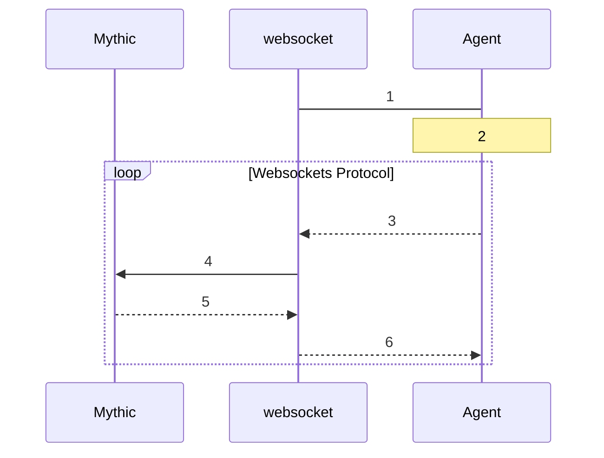

# websocket

This is a Mythic C2 Profile called websocket. It provides a way for agents to connect in via a static websocket connection and then make their standard beaconing traffic within the single connection. This profile includes:

* Kill Dates
* Sleep Intervals (for the messages within the single websocket connection)
* Support for SSL

The c2 profile has `mythic_c2_container==0.0.22` PyPi package installed and reports to Mythic as version "3".

## Websockets C2 Workflow

1. The Agent sends an HTTP/S Upgrade request to the Websockets server. The server responds with "HTTP/1.1 101 Switching Protocols". 
2. The Agent and Websocket server begin using the websockets protocol to send and receive messages.
3. Agent sends a message to receive taskings from server. The Message is inside a `Text Frame` as JSON of `{"client":true,"data": <b64data_to_mythic>,"tag":""}`
4. Websocket sends a GET/POST request to receive taskings from Mythic
5. Mythic returns tasks to Websocket
6. Websocket sends new tasks to the agent. The Message is inside a `Text Frame` as JSON of `{"client":false,"data": <b64data_from_mythic>,"tag":""}`

## How to install an agent in this format within Mythic

Use mythic-cli to install it:
`sudo ./mythic-cli install github https://github.com/MythicC2Profiles/websocket.git`

See https://docs.mythic-c2.net/installation#installing-agents-c2-profiles for more information
